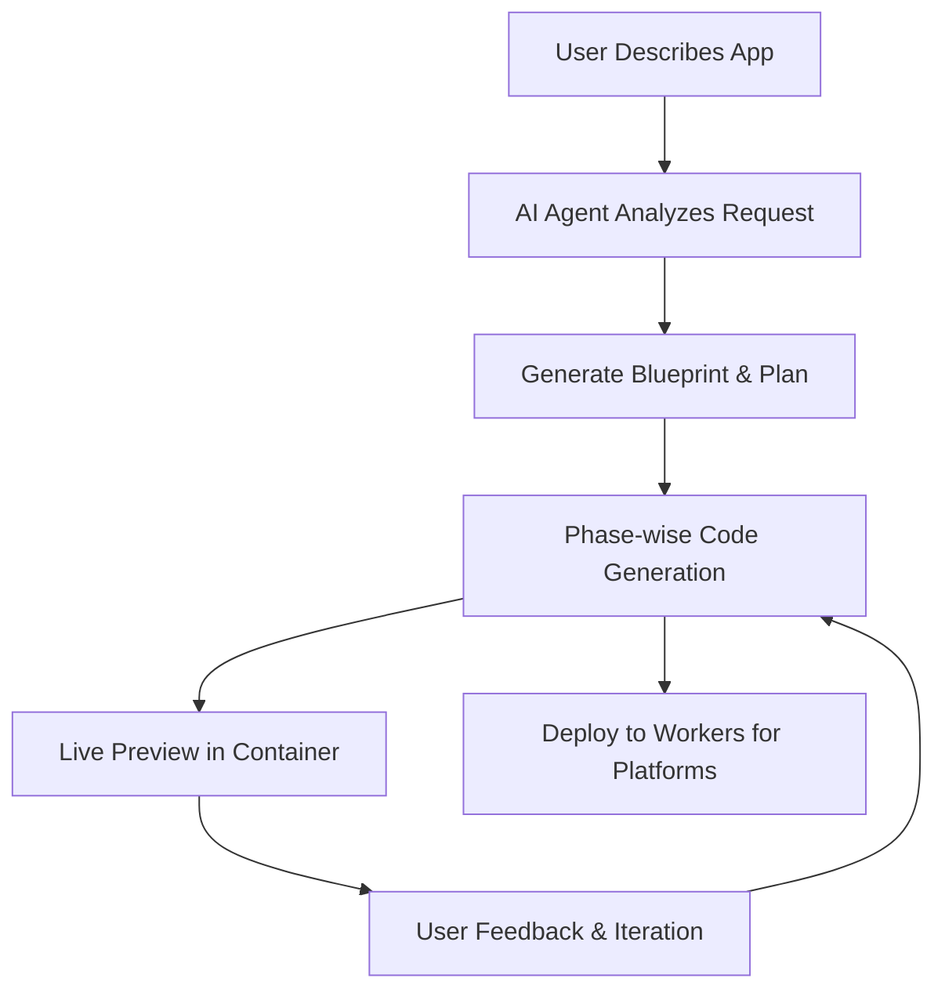

# 🧡 Cloudflare Orange Build

> **An open source full-stack AI webapp generator** – Deploy your own instance of Cloudflare Orange Build, an alternative to platforms like Lovable, V0, and Bolt that you can run and customize yourself.

<div align="center">

[](https://deploy.workers.cloudflare.com/?url=https://github.com/AshishKumar4/cloudflare-orange-build)

**👆 Click to deploy your own Vibe coding platform!**

*Follow the setup guide below to configure required services*

</div>

---

## 📚 Table of Contents

### Quick Start
- [🚀 Deploy to Cloudflare](#-deploy-to-cloudflare)
- [⚙️ Required Configuration](#️-required-configuration)
- [📋 Configuration Checklist](#-configuration-checklist)

### Platform Overview
- [✨ What is Cloudflare Orange Build?](#-what-is-cloudflare-orange-build)
- [💡 Try These Example Prompts](#-try-these-example-prompts)
- [🎨 How It Works](#-how-it-works)

### Architecture & Features
- [🌍 Architecture Deep Dive](#-architecture-deep-dive)
- [🎯 Perfect For](#-perfect-for)
- [📊 System Requirements](#-system-requirements)

### Development & Management
- [🏠 Local Development](#-local-development)
- [🗑️ Undeployment Guide](#️-undeployment-guide)
- [🔐 Complete Secrets & Variables Reference](#-complete-secrets--variables-reference)

### Support & Community
- [❓ Troubleshooting](#-troubleshooting)
- [🔒 Security & Privacy](#-security--privacy)
- [🤝 Contributing](#-contributing)
- [📚 Resources](#-resources)

---

## 🚀 Deploy to Cloudflare

Deploy your own Cloudflare Orange Build instance. The process takes about 5 minutes with proper setup:

**Step 1: Click Deploy Button** 🔗  
Click the deploy button above to start the process

**Step 2: Connect Git Account** ☁️  
Connect your GitHub/Gitlab account to Cloudflare  

**Step 3: Configure Services** ⚙️  
You'll be prompted to configure the required services below

**Step 4: Deploy** 🚀  
Once configured, deployment happens automatically

---

## ⚙️ Required Configuration

During deployment, you'll need to configure these **mandatory** services. Have them ready before clicking deploy:

### 🔑 1. Cloudflare API Token (Required)

Create an API token with these specific permissions:

1. Go to [Cloudflare Dashboard](https://dash.cloudflare.com) → **My Profile** → **API Tokens**
2. Click **Create Token** → **Custom Token**
3. Add these **exact permissions**:

   **Account permissions:**
   - `Workers Scripts: Edit`
   - `Workers AI: Edit` 
   - `D1: Edit`
   - `Workers KV Storage: Edit`
   - `Workers R2 Storage: Edit`
   - `Account Settings: Read`
   - `User Details: Read`

   **Zone permissions (for all zones):**
   - `Workers Routes: Edit`

4. Set **Account Resources** to `Include: All accounts`
5. Click **Continue to Summary** → **Create Token**
6. **Save this token** - you'll need it during deployment

### 🤖 2. AI Gateway Setup (Conditional)

Cloudflare Orange Build requires an authenticated AI Gateway, but **setup is automatic if you provide the right token**:

#### Option A: Automatic Setup (Recommended)
If you have a `CLOUDFLARE_AI_GATEWAY_TOKEN` with **Read, Edit, and Run** permissions, the deployment script will automatically create and configure the AI Gateway for you. **No manual setup required!**

#### Option B: Manual Setup (If no token provided)
Only if you **don't** have an AI Gateway token, manually create one:

1. Go to [AI Gateway Dashboard](https://dash.cloudflare.com/ai/ai-gateway)
2. Click **Create Gateway**
3. Name: `orange-build-gateway` (or your preferred name)
4. **Important**: Enable **Authenticated Gateway** 
5. Click **Create authentication token**
6. Configure token with **AI Gateway Run** permissions
7. **Save both**:
   - Gateway URL: `https://gateway.ai.cloudflare.com/v1/{account-id}/{gateway-name}`
   - Authentication token

### 🔐 3. Required Variables (Required)

The "Deploy to Cloudflare" button configures two types of variables:

#### Build Variables (Available to deploy.ts script)
These are needed during deployment and must be provided as build variables:

**Essential Build Variables:**
- `CLOUDFLARE_API_TOKEN` - Your Cloudflare API token (from step 1)

**AI Gateway Build Variable (Highly Recommended):**
- `CLOUDFLARE_AI_GATEWAY_TOKEN` - AI Gateway token with Read, Edit, and **Run** permissions
  - **Important**: Also add this as a Worker Secret (see below) for runtime access

#### Worker Secrets (Available to your deployed app)
These are encrypted secrets available to your running Worker:

**AI Provider API Keys (Required):**
> **⚠️ Currently Required**: The following AI provider API keys are mandatory for the platform to function. We are actively working to make these optional and easily configurable in future releases.

- `ANTHROPIC_API_KEY` - Your Anthropic API key for Claude models
- `OPENAI_API_KEY` - Your OpenAI API key for GPT models  
- `GEMINI_API_KEY` - Your Google Gemini API key for Gemini models

> **💡 AI Gateway Wholesaling Alternative**: If you have **AI Gateway Wholesaling** enabled on your Cloudflare account, you can skip the individual provider API keys above. Instead, you'll need your AI Gateway token with proper Run permissions.

**Authentication Secrets:**
- `JWT_SECRET` - Secure random string for session management
- `CLOUDFLARE_AI_GATEWAY_TOKEN` - AI Gateway token (also needed as build variable above)

**Optional OAuth Secrets:**
- `GOOGLE_CLIENT_ID` - Google OAuth client ID
- `GOOGLE_CLIENT_SECRET` - Google OAuth client secret
- `GITHUB_CLIENT_ID` - GitHub OAuth client ID
- `GITHUB_CLIENT_SECRET` - GitHub OAuth client secret
- `WEBHOOK_SECRET` - Webhook authentication secret

#### Environment Variables (Set in wrangler.jsonc)
These are configured automatically in `wrangler.jsonc` and don't need manual setup:

- `CLOUDFLARE_ACCOUNT_ID` - Your Cloudflare Account ID
- `TEMPLATES_REPOSITORY` - GitHub repository for app templates
- `CLOUDFLARE_AI_GATEWAY` - AI Gateway name (default: `orange-build-gateway`)
- `MAX_SANDBOX_INSTANCES` - Maximum container instances (default: `2`)

> **💡 Automatic vs Manual Setup**: 
> - **With `CLOUDFLARE_AI_GATEWAY_TOKEN`**: Deployment automatically creates and configures AI Gateway for you
> - **Without token**: You must manually create AI Gateway named `orange-build-gateway` before deployment

### 🔗 4. OAuth Setup (Optional)

For user authentication (can skip for testing):

**Google OAuth:**
1. [Google Cloud Console](https://console.cloud.google.com) → Create Project
2. Enable **Google+ API** 
3. Create **OAuth 2.0 Client ID**
4. Add authorized origins: `https://your-worker-name.workers.dev`
5. Add redirect URI: `https://your-worker-name.workers.dev/api/auth/google/callback`
6. Configure these environment variables:
   - `GOOGLE_CLIENT_ID` - Your Google Client ID
   - `GOOGLE_CLIENT_SECRET` - Your Google Client Secret

**GitHub OAuth:**
1. GitHub → **Settings** → **Developer settings** → **OAuth Apps**
2. Click **New OAuth App**
3. Application name: `Cloudflare Orange Build`
4. Homepage URL: `https://your-worker-name.workers.dev`
5. Authorization callback URL: `https://your-worker-name.workers.dev/api/auth/github/callback`
6. Configure these environment variables:
   - `GITHUB_CLIENT_ID` - Your GitHub Client ID
   - `GITHUB_CLIENT_SECRET` - Your GitHub Client Secret
---

## 📋 Configuration Checklist

Before clicking deploy, ensure you have:

**Build Variables (Required):**
- ✅ **CLOUDFLARE_API_TOKEN** - API token with all required permissions

**Worker Secrets (Required):**
- ✅ **AI Provider API Keys** (all three required):
  - `ANTHROPIC_API_KEY` - Anthropic Claude API access  
  - `OPENAI_API_KEY` - OpenAI API access
  - `GEMINI_API_KEY` - Google Gemini API access
- ✅ **JWT_SECRET** - Secure random string for session management

**Highly Recommended (Both Build Variable AND Worker Secret):**
- ✅ **CLOUDFLARE_AI_GATEWAY_TOKEN** - AI Gateway token with Read, Edit, and **Run** permissions
  - Add as **Build Variable** for automatic AI Gateway creation during deployment
  - Add as **Worker Secret** for runtime access to AI Gateway
  - *Without this, you must manually create the AI Gateway before deployment*

**Optional Worker Secrets:**
- ⚪ **OAuth credentials** (GOOGLE_CLIENT_ID, GOOGLE_CLIENT_SECRET, GITHUB_CLIENT_ID, GITHUB_CLIENT_SECRET)
- ⚪ **WEBHOOK_SECRET** - For webhook authentication

**Automatic Configuration (No manual setup needed):**
- 🔧 **Environment Variables** - Pre-configured in wrangler.jsonc (CLOUDFLARE_ACCOUNT_ID, TEMPLATES_REPOSITORY, etc.)

> **💡 AI Gateway Wholesaling Users**: If you have AI Gateway Wholesaling enabled, you can skip the individual AI provider API keys and just use your AI Gateway token with Run permissions.

> **🔑 Important**: `CLOUDFLARE_AI_GATEWAY_TOKEN` should be provided as BOTH a build variable and a worker secret for full functionality.

---

## ✨ What is Cloudflare Orange Build?

Cloudflare Orange Build is an open source **text-to-app** platform built on Cloudflare's developer ecosystem. It provides an alternative to proprietary platforms like Lovable, V0, and Bolt that you can deploy and customize yourself. Describe what you want to build in plain English, and AI agents create, deploy, and iterate on complete web applications.

### 🎯 Key Features

🤖 **AI Code Generation** – Phase-wise development with intelligent error correction  
⚡ **Live Previews** – App previews running in sandboxed containers  
💬 **Interactive Chat** – Guide development through natural conversation  
📱 **Modern Stack** – Generates React + TypeScript + Tailwind apps  
🚀 **One-Click Deploy** – Deploy generated apps to Workers for Platforms  
📦 **GitHub Integration** – Export code directly to your repositories  

### 🏗️ Built on Cloudflare's Platform

Cloudflare Orange Build utilizes the full Cloudflare developer ecosystem:

- **Frontend**: React + Vite with modern UI components
- **Backend**: Workers with Durable Objects for AI agents  
- **Database**: D1 (SQLite) with Drizzle ORM
- **AI**: Multiple LLM providers via AI Gateway
- **Containers**: Sandboxed app previews and execution
- **Storage**: R2 buckets for templates, KV for sessions
- **Deployment**: Workers for Platforms with dispatch namespaces

---

## 💡 Try These Example Prompts

Once deployed, try these prompts to see Cloudflare Orange Build in action:

**🎮 Fun Apps**
> "Create a todo list with drag and drop and dark mode"

> "Build a simple drawing app with different brush sizes and colors"

> "Make a memory card game with emojis"

**📊 Productivity Apps**  
> "Create an expense tracker with charts and categories"

> "Build a pomodoro timer with task management"

> "Make a habit tracker with streak counters"

**🎨 Creative Tools**
> "Build a color palette generator from images"

> "Create a markdown editor with live preview"  

> "Make a meme generator with text overlays"

**🛠️ Utility Apps**
> "Create a QR code generator and scanner"

> "Build a password generator with custom options"

> "Make a URL shortener with click analytics"

---

## 🎨 How It Works



### How It Works

1. **🧠 AI Analysis**: Language models process your description
2. **📋 Blueprint Creation**: System architecture and file structure planned
3. **⚡ Phase Generation**: Code generated incrementally with dependency management
4. **🔍 Quality Assurance**: Automated linting, type checking, and error correction
5. **📱 Live Preview**: App execution in isolated Cloudflare Containers
6. **🔄 Real-time Iteration**: Chat interface enables continuous refinements
7. **🚀 One-Click Deploy**: Generated apps deploy to Workers for Platforms

---

## 🌍 Architecture Deep Dive

### Durable Objects for Stateful AI Agents
```typescript
class CodeGeneratorAgent extends DurableObject {
  async generateCode(prompt: string) {
    // Persistent state across WebSocket connections
    // Phase-wise generation with error recovery
    // Real-time progress streaming to frontend
  }
}
```

### Workers for Platforms Deployment
```javascript
// Generated apps deployed to dispatch namespace
export default {
  async fetch(request, env) {
    const appId = extractAppId(request);
    const userApp = env.DISPATCHER.get(appId);
    return await userApp.fetch(request);
  }
};
```

### Phase-wise Code Generation
Cloudflare Orange Build generates apps in intelligent phases:

1. **Planning Phase**: Analyzes requirements, creates file structure
2. **Foundation Phase**: Generates package.json, basic setup files  
3. **Core Phase**: Creates main components and logic
4. **Styling Phase**: Adds CSS and visual design
5. **Integration Phase**: Connects APIs and external services
6. **Optimization Phase**: Performance improvements and error fixes

---

## 🎯 Perfect For

### 🚀 **Rapid Prototyping**
Turn ideas into working apps quickly

### 📚 **Learning Web Development** 
See modern React patterns generated and explained in real-time

### 🏢 **Client Demos**
Create proof-of-concepts for stakeholders

### ⚡ **Hackathons**
Build and deploy complete applications efficiently

### 🔬 **Platform Exploration**
Experience Cloudflare's developer platform capabilities

---

## 📊 System Requirements

### For Users
- **Cloudflare Account** (Workers paid plan recommended for full features)
- **GitHub Account** (free)
- **Modern Browser** (Chrome 90+, Firefox 88+, Safari 14+)

### Auto-Provisioned Resources
The deploy button automatically creates:
- **D1 Database** (SQLite at the edge)
- **Durable Objects** (stateful serverless objects)
- **R2 Storage** (object storage for templates)
- **KV Storage** (key-value storage for sessions)
- **Workers AI Binding** (if enabled)
- **Dispatch Namespace** (for user app deployment)

---

## ❓ Troubleshooting

### Common Deploy Issues

**🚫 "Insufficient Permissions" Error**
- Ensure your API token has ALL required permissions listed above
- Check that token hasn't expired
- Verify account access is set to "Include all accounts"

**🤖 "AI Gateway Authentication Failed"**  
- Confirm AI Gateway is set to **Authenticated** mode
- Verify the authentication token has **Run** permissions
- Check that gateway URL format is correct

**🗄️ "Database Migration Failed"**
- Ensure API token has **D1 Edit** permissions
- Check that account has D1 access enabled
- Wait a few minutes and retry - D1 resources may take time to provision

**🔐 "Missing Required Variables"**
- **Build Variables**: Ensure `CLOUDFLARE_API_TOKEN` is provided as a build variable
- **Worker Secrets**: Verify all required secrets are set: `ANTHROPIC_API_KEY`, `OPENAI_API_KEY`, `GEMINI_API_KEY`, `JWT_SECRET`
- **AI Gateway Token**: `CLOUDFLARE_AI_GATEWAY_TOKEN` should be set as BOTH build variable and worker secret
- **Environment Variables**: These are automatically loaded from wrangler.jsonc - no manual setup needed

**🤖 "AI Gateway Not Found"**
- **With AI Gateway Token**: The deployment script should automatically create the gateway. Check that your token has Read, Edit, and **Run** permissions.
- **Without AI Gateway Token**: You must manually create an AI Gateway before deployment:
  1. Go to [AI Gateway Dashboard](https://dash.cloudflare.com/ai/ai-gateway)
  2. Create gateway named `orange-build-gateway` (or your custom name)
  3. Enable authentication and create a token with **Run** permissions

**💡 "AI Gateway Wholesaling"**
- Users with AI Gateway Wholesaling can skip individual provider API keys
- Ensure your AI Gateway token has proper Run permissions for all providers

### Need Help?

- 📖 Check [Cloudflare Workers Docs](https://developers.cloudflare.com/workers/)
- 💬 Join [Cloudflare Discord](https://discord.gg/cloudflaredev)
- 🐛 Report issues on [GitHub](https://github.com/your-org/cloudflare-vibecoding-starter-kit/issues)

---

## 🏠 Local Development

Here's how to run it locally:

### Prerequisites
- Node.js 18+, Cloudflare account with Workers paid plan

### Quick Setup
```bash
git clone https://github.com/your-username/cloudflare-vibecoding-starter-kit.git
cd cloudflare-vibecoding-starter-kit && bun install

cp .dev.vars.example .dev.vars
# Edit .dev.vars with proper values

bun run install
bun run db:generate && bun run db:migrate:local
bun run dev

# To deploy
bun run deploy
```

### Development Commands
```bash
bun run dev              # Start development servers
bun run build            # Build for production
bun run deploy           # Deploy to Cloudflare
bun run db:generate && bun run db:migrate:local
bun run lint             # Run code quality checks
```

---

## 🗑️ Undeployment Guide

When you need to clean up or remove your Cloudflare Orange Build instance, use the automated undeployment script:

### Standard Cleanup (Recommended)
```bash
bun scripts/undeploy.ts
```
**What it does:**
- ✅ Deletes Worker and all containers
- ✅ Removes all container images
- ✅ Deletes KV namespaces and R2 buckets
- ⚪ **Preserves** D1 database (your data stays safe)
- ⚪ **Preserves** dispatch namespace (for future deployments)

### Complete Destruction (Use with Caution)
```bash
bun scripts/undeploy.ts all --force
```
**What it does:**
- ✅ Everything from standard cleanup, PLUS:
- ⚠️ **PERMANENTLY DELETES** D1 database and all data
- ⚠️ **PERMANENTLY DELETES** dispatch namespace

> **⚠️ WARNING**: The `all --force` mode will **permanently delete ALL your data**. This cannot be undone. Only use this when you're completely sure you want to destroy everything.

### Authentication Requirements

**For Container Deletion**: The script requires **API Token authentication** (not OAuth) to delete containers. If you see authentication errors:

1. **Option A**: Use API token authentication
   ```bash
   wrangler logout
   export CLOUDFLARE_API_TOKEN="your-api-token-here"
   bun scripts/undeploy.ts
   ```

2. **Option B**: Use wrangler login with API token
   ```bash
   wrangler login  # Choose API token option when prompted
   bun scripts/undeploy.ts
   ```

### What Resources Are Deleted

| Resource Type | Standard Mode | Complete Mode (`all --force`) |
|---------------|---------------|-------------------------------|
| Worker | ✅ Deleted | ✅ Deleted |
| Containers | ✅ Deleted | ✅ Deleted |
| Container Images | ✅ Deleted | ✅ Deleted |
| KV Namespaces | ✅ Deleted | ✅ Deleted |
| R2 Buckets | ✅ Deleted | ✅ Deleted |
| D1 Database | ⚪ Preserved | ⚠️ **DELETED** |
| Dispatch Namespace | ⚪ Preserved | ⚠️ **DELETED** |

### Safety Features

- **Parallel Processing**: Multiple resources are deleted simultaneously for faster cleanup
- **Non-Interactive Mode**: Automatic confirmation handling prevents hanging prompts  
- **Error Resilience**: Failed deletions don't stop the entire process
- **Clear Feedback**: Detailed progress reporting and final summary
- **Safe Defaults**: Standard mode preserves critical data by default

### Troubleshooting Common Issues

**"Binding name already in use" during redeployment:**
```bash
# After undeployment, if you see this error during next deployment:
bun scripts/undeploy.ts  # Clean up first
bun run deploy           # Then redeploy fresh
```

**"DELETE method not allowed" for containers:**
```bash
# Switch to API token authentication:
export CLOUDFLARE_API_TOKEN="your-token"
bun scripts/undeploy.ts
```

**Resources already deleted manually:**
- The script safely handles resources that don't exist
- Check the final summary to see what was actually deleted vs. already missing

---

## 🔐 Complete Secrets & Variables Reference

This section provides comprehensive documentation for all configuration variables used in Cloudflare Orange Build, organized by their purpose and location.

### Environment Variables (wrangler.jsonc `vars` section)

These variables are configured in `wrangler.jsonc` and are available to your Worker at runtime. They are **not encrypted** and should only contain non-sensitive configuration.

#### Core Platform Configuration
```jsonc
"vars": {
  "TEMPLATES_REPOSITORY": "https://github.com/AshishKumar4/cloudflare-build-templates",
  "CLOUDFLARE_AI_GATEWAY": "c-coder",
  "CUSTOM_DOMAIN": "build.cloudflare.dev", 
  "MAX_SANDBOX_INSTANCES": "2",
  "CLOUDFLARE_AI_GATEWAY_URL": ""
}
```

| Variable | Default Value | Description | Required |
|----------|---------------|-------------|----------|
| `TEMPLATES_REPOSITORY` | `"https://github.com/AshishKumar4/cloudflare-build-templates"` | GitHub repository containing app templates for code generation | ✅ Yes |
| `CLOUDFLARE_AI_GATEWAY` | `"c-coder"` | Name of your Cloudflare AI Gateway for AI provider routing | ✅ Yes |
| `CUSTOM_DOMAIN` | `"build.cloudflare.dev"` | Custom domain for your Orange Build instance | ⚪ Optional |
| `MAX_SANDBOX_INSTANCES` | `"2"` | Maximum number of concurrent container instances for app previews | ⚪ Optional |
| `CLOUDFLARE_AI_GATEWAY_URL` | `""` | Full URL to your AI Gateway (auto-generated if empty) | ⚪ Optional |

#### Additional Auto-Configured Variables
These are typically set automatically by the deployment script:

| Variable | Description | Example |
|----------|-------------|---------|
| `CLOUDFLARE_ACCOUNT_ID` | Your Cloudflare Account ID | `"abc123def456789..."` |

### Worker Secrets (.dev.vars / .prod.vars)

These are **encrypted secrets** stored securely by Cloudflare Workers. They contain sensitive API keys and tokens.

#### Essential Secrets (Required)

**Cloudflare Authentication:**
```bash
CLOUDFLARE_API_TOKEN="your-cf-api-token-with-workers-ai-d1-permissions"
CLOUDFLARE_ACCOUNT_ID="your-cloudflare-account-id"
```

**AI Gateway Authentication:**
```bash
CLOUDFLARE_AI_GATEWAY_TOKEN="your-ai-gateway-token-with-run-permissions"
```

**AI Provider API Keys** (All Required):
```bash
ANTHROPIC_API_KEY="sk-ant-api03-..."        # Claude models access
OPENAI_API_KEY="sk-..."                     # GPT models access  
GEMINI_API_KEY="AIzaSy..."                  # Google Gemini models access
```

**Session Security:**
```bash
JWT_SECRET="secure-random-string-for-sessions"
```

#### Optional Secrets

**Additional AI Providers:**
```bash
OPENROUTER_API_KEY="sk-or-..."              # OpenRouter API access (optional)
GROQ_API_KEY="gsk_..."                      # Groq API access (optional)
```

**OAuth Authentication Providers:**
```bash
# Google OAuth (for user login)
GOOGLE_CLIENT_ID="your-google-oauth-client-id"
GOOGLE_CLIENT_SECRET="your-google-oauth-client-secret"

# GitHub OAuth (for user login)
GITHUB_CLIENT_ID="your-github-oauth-app-id"
GITHUB_CLIENT_SECRET="your-github-oauth-app-secret"
```

**Webhook Security:**
```bash
WEBHOOK_SECRET="secure-random-string-for-webhook-validation"
```

### Build-Time Variables

These variables are available during deployment and should be configured as **Build Variables** in your deployment environment:

| Variable | Purpose | Required |
|----------|---------|----------|
| `CLOUDFLARE_API_TOKEN` | API access for resource creation during deployment | ✅ Required |
| `CLOUDFLARE_AI_GATEWAY_TOKEN` | Enables automatic AI Gateway setup during deployment | 🟡 Recommended |

### Cloudflare Resource Bindings (wrangler.jsonc)

These are automatically configured by Wrangler and don't require manual setup:

#### Database & Storage Bindings
```jsonc
"d1_databases": [
  {
    "binding": "DB",                          // Access via env.DB
    "database_name": "orange-build-db",
    "database_id": "auto-generated"
  }
],
"r2_buckets": [
  {
    "binding": "TEMPLATES_BUCKET",           // Access via env.TEMPLATES_BUCKET  
    "bucket_name": "orange-build-templates"
  }
],
"kv_namespaces": [
  {
    "binding": "INSTANCE_REGISTRY",          // Access via env.INSTANCE_REGISTRY
    "id": "auto-generated"
  }
]
```

#### AI & Container Bindings
```jsonc
"ai": {
  "binding": "AI"                           // Access via env.AI
},
"containers": [
  {
    "class_name": "UserAppSandboxService",   // Access via env.UserAppSandboxService
    "image": "./SandboxDockerfile",
    "max_instances": 200
  },
  {
    "class_name": "DeployerService",         // Access via env.DeployerService
    "image": "./DeployerDockerfile", 
    "max_instances": 1
  }
]
```

#### Durable Objects & Services
```jsonc
"durable_objects": {
  "bindings": [
    {
      "class_name": "CodeGeneratorAgent",    // Access via env.CodeGenObject
      "name": "CodeGenObject"
    },
    {
      "class_name": "UserAppSandboxService", // Access via env.Sandbox
      "name": "Sandbox"
    }
  ]
},
"services": [
  {
    "binding": "RUNNER_SERVICE",            // Access via env.RUNNER_SERVICE
    "service": "runner-service"
  }
]
```

### Setting Up Your Configuration

#### For Local Development (.dev.vars)
1. Copy the example file: `cp .dev.vars.example .dev.vars`
2. Fill in your API keys and tokens
3. Leave optional values as `"default"` if not needed

#### For Production Deployment
1. **Build Variables**: Set in your deployment platform (GitHub Actions, etc.)
2. **Worker Secrets**: Automatically handled by deployment script or set manually:
   ```bash
   wrangler secret put ANTHROPIC_API_KEY
   wrangler secret put OPENAI_API_KEY
   wrangler secret put GEMINI_API_KEY
   # ... etc
   ```

#### Environment Variable Priority
The deployment system follows this priority order:
1. **Environment Variables** (highest priority)
2. **wrangler.jsonc vars**
3. **Default values** (lowest priority)

Example: If `MAX_SANDBOX_INSTANCES` is set both as an environment variable (`export MAX_SANDBOX_INSTANCES=5`) and in wrangler.jsonc (`"MAX_SANDBOX_INSTANCES": "2"`), the environment variable value (`5`) will be used.

### Security Best Practices

- ✅ **Never commit secrets** to version control
- ✅ **Use separate configurations** for development and production  
- ✅ **Rotate API keys regularly**, especially for production
- ✅ **Set minimal required permissions** for API tokens
- ✅ **Use strong random strings** for JWT_SECRET and WEBHOOK_SECRET
- ⚠️ **Store secrets in encrypted worker secrets**, not environment variables
- ⚠️ **Validate all secrets are set** before deployment

---

## 🔒 Security & Privacy

Cloudflare Orange Build implements enterprise-grade security:

- 🔐 **Encrypted Secrets**: All API keys stored with Cloudflare encryption
- 🏰 **Sandboxed Execution**: Generated apps run in completely isolated containers
- 🛡️ **Input Validation**: All user inputs sanitized and validated
- 🚨 **Rate Limiting**: Prevents abuse and ensures fair usage
- 🔍 **Content Filtering**: AI-powered detection of inappropriate content
- 📝 **Audit Logs**: Complete tracking of all generation activities

---

## 🤝 Contributing

Want to contribute to Cloudflare Orange Build? Here's how:

1. **🍴 Fork** via the Deploy button (creates your own instance!)
2. **💻 Develop** new features or improvements  
3. **✅ Test** thoroughly with `bun run test`
4. **📤 Submit** Pull Request to the main repository

### Development Focus Areas
- 🧠 **AI Models**: Add support for new LLM providers
- 🎨 **Templates**: Create new app templates and frameworks
- 🔧 **Tools**: Improve code generation and error handling
- 📱 **UI/UX**: Enhance the chat interface and preview experience

---

## 📚 Resources

### 🛠️ **Cloudflare Platform**
- [Workers](https://developers.cloudflare.com/workers/) - Serverless compute platform
- [Durable Objects](https://developers.cloudflare.com/durable-objects/) - Stateful serverless objects
- [D1](https://developers.cloudflare.com/d1/) - SQLite database at the edge
- [R2](https://developers.cloudflare.com/r2/) - Object storage without egress fees
- [AI Gateway](https://developers.cloudflare.com/ai-gateway/) - Unified AI API gateway

### 💬 **Community**  
- [Discord](https://discord.gg/cloudflaredev) - Real-time chat and support
- [Community Forum](https://community.cloudflare.com/) - Technical discussions
- [GitHub Discussions](https://github.com/your-org/cloudflare-vibecoding-starter-kit/discussions) - Feature requests and ideas

### 🎓 **Learning Resources**
- [Workers Learning Path](https://developers.cloudflare.com/learning-paths/workers/) - Master Workers development
- [Full-Stack Guide](https://developers.cloudflare.com/pages/tutorials/build-a-blog-using-nuxt-and-sanity/) - Build complete applications
- [AI Integration](https://developers.cloudflare.com/workers-ai/) - Add AI to your apps

---

## 📄 License

MIT License - see [LICENSE](LICENSE) for details.

---

<div align="center">

### 🧡 Ready to Deploy Your Own Instance?

**Set up your own AI webapp generator with proper configuration**

[](https://deploy.workers.cloudflare.com/?url=https://github.com/your-org/cloudflare-vibecoding-starter-kit)

*Make sure to complete the configuration steps above first*

---

[🌟 Star on GitHub](https://github.com/your-org/cloudflare-vibecoding-starter-kit) • [📖 Documentation](./CLAUDE.md) • [💬 Community](https://discord.gg/cloudflaredev) • [🚀 Live Demo](https://build.cloudflare.dev)

**Built with ❤️ on Cloudflare's Developer Platform**

</div>